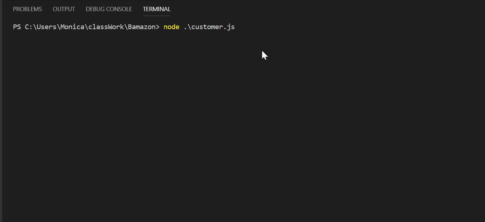
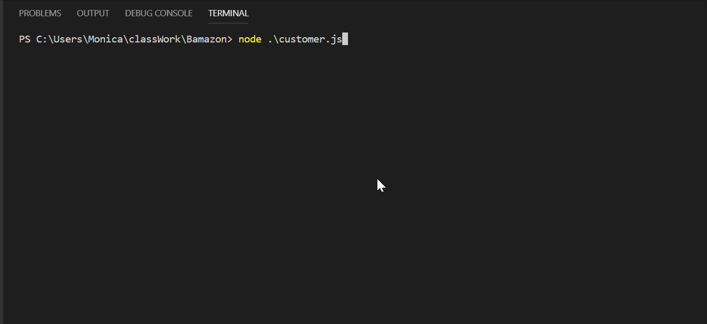

# Bamazon

## Purpose
The purpose of this application is to utilize mySQL in order to create a basic storefront app. 

## Overview
The user will be able to see a complete list of all the items in the database, select an item, and select a quantity they want to order.
They will also be given an option to search products by departments.

## Use Cases

### Show items

### Department search
